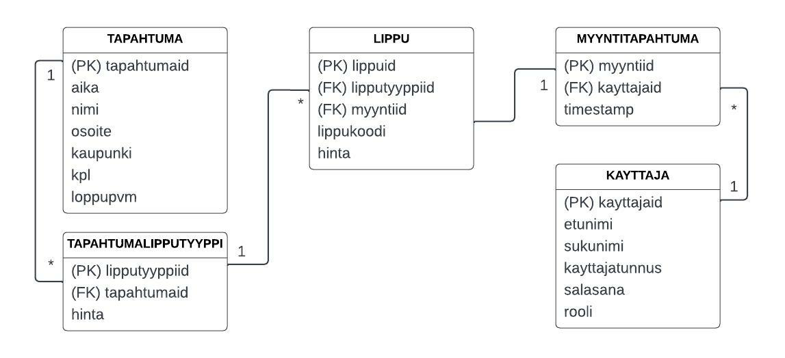

# TicketGuru - Team Etappi

Tiimi: Anne Pelin, Elia Ahonen, Pertti Korhonen, Taina Kankainen

Haaga-Helian Ohjelmistoprojekti I -kurssin projektityö

## Johdanto

-   Projektina on myyntipisteen lipunmyyntijärjestelmä, alustavalta nimeltä TicketGuru, joka toteutetaan lipputoimisto asiakkaalle (edustajana tuoteomistaja Markku Ruonavaara). Projektissa rakennetaan lipunmyyntijärjestelmä lipunmyyntipisteen myyjille - kyseessä ei siis ole verkkoalusta, josta asiakas voi itse käydä ostamassa lipun. Järjestelmässä tulee voida käsitellä tapahtumia, joihin lippuja myydään, myydä lippuja ja tulostaa niitä, sekä seurata myyntiä.
-   Toteutus- ja toimintaympäristö lyhyesti:  
    -   REST-palvelu ja tietokanta, sisältäen CRUD-toiminnallisuudet järjestelmän sisältämille tiedoille, sekä osittaisen käyttäjän tunnistautumistarpeen
    -   Päätelaitteina laptop/desktop, palvelu toteutetaan Javalla Spring Boot -kehyksen avulla ja tulokset talletetaan GitHubiin

## Järjestelmän määrittely

### Roolit
- lipputoimiston työntekijä
- lipunmyyntipisteen lipunmyyjä

### Käyttötapauskaavio

### Käyttäjätarinat
##### Tunnus: K1
Lipputoimiston työntekijänä haluan, että voin luoda myynnissä olevat tapahtumat,
koska lipunmyyntipisteen myyjän pitää pystyä myymään lippuja tiettyyn tapahtumaan.
prioriteetti = 1, tyyppi: toiminnallinen
##### Tunnus: K2
Lipputoimiston työntekijänä haluan pystyä muuttamaan tapahtuman tietoja, koska on mahdollista, että ohjelmassa olevaa tietoa pitää ajantasaistaa.
prioriteetti = 1, tyyppi: toiminnallinen
##### Tunnus: K3 
Lipputoimiston työntekijänä haluan, että voin määritellä tapahtuman lipputyypit ja hinnat, koska tapahtumaan pitää pystyä myymään lippuja eri asiakastyypeille.
prioriteetti = 1, tyyppi: toiminnallinen
##### Tunnus: K4 
Lipputoimiston työntekijänä haluan, että voin vaihtaa hintaa tietylle lipulle.
prioriteetti = 1, tyyppi: toiminnallinen
##### Tunnus: K5
Lipunmyyjänä haluan, että voin hakea tapahtumia eri hakusanoilla, koska asiakkaalle pitää voida myydä lippu hänen haluamaansa tapahtumaan.
prioriteetti = 1, tyyppi: toiminnallinen
##### Tunnus: K6
Lipunmyyjänä haluan, että voin myydä lipun tiettyyn tapahtumaan, koska asiakkaalle pitää voida myydä lippu hänen haluamaansa tapahtumaan.
prioriteetti = 1, tyyppi: toiminnallinen
##### Tunnus: K7
Lipunmyyjänä haluan nähdä tapahtuman jäljellä olevien lippujen määrän, jotta lippuja ei myydä tapahtumaan liikaa.
prioriteetti = 1, tyyppi: toiminnallinen
##### Tunnus: K8
Lipunmyyjänä haluan pystyä myymään useita lippuja samalla tilauksella, jotta jokaista lippua ei tarvitse myydä erikseen.
prioriteetti = 1, tyyppi: toiminnallinen
##### Tunnus: K9
Lipunmyyjänä haluan, että voin tulostaa lippuja, koska asiakkaalle pitää tulostaa ostettu lippu.
prioriteetti = 1, Tyyppi: toiminnallinen
##### Tunnus: K10
Ovimikkona haluan, että voin tarkistaa lipun lippukoodin perusteella.
prioriteetti = 1, tyyppi: toiminnallinen

## Käyttöliittymä

[Wireframe-malli](https://github.com/tkankainen/etappi-ticketguru/blob/development/Kuvat/TicketGuru%20UI.pdf) kuvaa alustavasti käyttöliittymän toimintoja.

## Tietokanta

> ### _Tapahtuma_
> _Tapahtuma-taulu sisältää tapahtumat. Tapahtumia voi olla monia._
>
> Kenttä | Tyyppi | Kuvaus
> ------ | ------ | ------
> tapahtumaid | auto PK | Tapahtuman id
> aika | date | Tapahtuman ajankohta (date & time)
> nimi | varchar(100) | Tapahtuman nimi
> osoite | varchar(100) | Tapahtuman osoite
> kaupunki | varchar(100) | Tapahtuman kaupunki
> kpl | int | Myytävien lippujen määrä
> loppupvm | date | Ajankohta, jolloin lippujen ennakkomyynti päättyy

> ### _Tapahtumalipputyyppi_
> _Tapahtumalipputyyppi-taulu sisältää lippujen hinnat ja yhdistää tapahtuman, lipun ja lipputyypin._
>
> Kenttä | Tyyppi | Kuvaus
> ------ | ------ | ------
> lipputyyppiid | auto PK | Taulun oma id
> tapahtumaid | FK | Tapahtuma-taulun id
> tyyppiid | FK | Lipputyyppi-taulun id
> hinta | int | Lipun hinta (perustuu lipputyyppiin)

> ### _Lippu_
> _Lippu-taulu sisältää tapahtumien lippujen tiedot. Lippuja voi olla monia._
>
> Kenttä | Tyyppi | Kuvaus
> ------ | ------ | ------
> lippuid | auto PK | Taulun oma id
> lipputyyppiid | FK | Tapahtumalipputyyppi-taulun id
> myyntiid | FK | Myyntitapahtuma-taulun id
> lippukoodi | varchar(50) | Lipun luettava myyntikoodi
> hinta | int | Lipun hinta

> ### _Myyntitapahtuma_
> _Myyntitapahtuma-taulu sisältää tiedot tehdyistä myyntitapahtumista._
>
> Kenttä | Tyyppi | Kuvaus
> ------ | ------ | ------
> myyntiid | auto PK | Taulun oma id
> kayttajaid | FK | Kayttaja-taulun id
> timestamp | timestamp | Myyntitapahtuman kellonaika ja päiväys

> ### _Kayttaja_
> _Kayttaja-taulu sisältää kaikkien järjestelmää käyttävien henkilöiden tiedot (lipunmyyjät/lipputoimiston työntekijät)._
>
> Kenttä | Tyyppi | Kuvaus
> ------ | ------ | ------
> kayttajaid | auto PK | Taulun oma id
> etunimi | varchar(50) | Käyttäjän etunimi
> sukunimi | varchar(50) | Käyttäjän sukunimi
> kayttajatunnus | varchar(25) | Käyttäjätunnus
> salasana | varchar(100) | Salasana
> rooli | varchar(50) | Käyttäjän rooli (lipunmyyjä/lipputoimiston työntekijä)

## REST API -dokumentaatio

#### [Käyttäjä](https://github.com/tkankainen/etappi-ticketguru/tree/main/REST%20API%20-dokumentaatio/Kayttaja)

#### [Lippu](https://github.com/tkankainen/etappi-ticketguru/tree/main/REST%20API%20-dokumentaatio/Lippu)

#### [Myyntitapahtuma](https://github.com/tkankainen/etappi-ticketguru/tree/main/REST%20API%20-dokumentaatio/Myyntitapahtuma)

#### [Tapahtuma](https://github.com/tkankainen/etappi-ticketguru/tree/main/REST%20API%20-dokumentaatio/Tapahtuma)

#### [Tapahtumalipputyyppi](https://github.com/tkankainen/etappi-ticketguru/tree/main/REST%20API%20-dokumentaatio/Tapahtumalipputyyppi)

#### [Autentikointi](https://github.com/tkankainen/etappi-ticketguru/blob/main/REST%20API%20-dokumentaatio/Autentikointi.md)

## Tekninen kuvaus

#### Back end:
- Java Spring Boot sovelluskehys
#### Ohjelmointiympäristö:
- Eclipse IDE for Java EE , Java-kehitysympäristö
- Maven projekti
#### Autentikointi:
- JSON Web Token
#### Tietokanta:
- PostgreSQL
#### Julkaisu, pilvipalvelu:
- Heroku
#### Versionhallinta:
- Git
#### Front End:
- React js.
#### Api-dokumentaatio:
[https://github.com/tkankainen/etappi-ticketguru/tree/main/REST%20API%20-dokumentaatio](https://github.com/tkankainen/etappi-ticketguru/tree/main/REST%20API%20-dokumentaatio)

## Testaus

Sovelluksesta testataan perustoimintoja, joiden avulla taataan sovelluksen haluttu vähittäistoiminnallisuus.

Se, että tietokannasta löytyy dataa tauluista, lipun luonti sekä autentikoinnin toiminnallisuus eri tyyppisten käyttäjien välillä tulee ilmi näistä testeistä.

Tarkempi [testausdokumentaatio](https://github.com/tkankainen/etappi-ticketguru/blob/main/Testaus/Testaus.md) löytyy Testaus-kansiosta.

## Asennustiedot

### Järjestelmän kehitysympäristö

- Projektin voi kloonata Githubista tästä repositorysta (https://github.com/tkankainen/etappi-ticketguru)

- Projektin voi avata Visual Studio Codella tai Eclipsellä

- Projekti käyttää PostgreSQL-tietokantaa (https://www.postgresql.org/). Kehitysympäristössä voi vaihtaa H2-tietokantaan vaihtamalla application.properties-tiedostossa rivien kommentointia ohjeen mukaan

- CommandLineRunner sisältää testidataa, jolla H2-tietokannan voi alustaa ottamalla kommentoinnin pois

- Käyttäjätunnukset ja salasanat ovat hallinnoitavissa application.properties-tiedostossa

- Postmanilla pyyntöjä lähetettäessä paikalliselle sovellukselle pyynnöt täytyy autentikoida JWT-tokenilla

### Järjestelmän asentaminen tuotantoympäristöön

- Projekti on julkaistu Herokussa

- Julkaistu projekti käyttää PostgreSQL-tietokantaa

- Tietokannan tiedot löytyvät application.properties-tiedostosta

- Tietokantayhteyteen tarvittavat tiedot määritellään ympäristömuuttujilla JDBC_DATABASE_URL (muodossa jdbc:postgresql://{host}:{port}/{database}), JDBC_DATABASE_USERNAME sekä JDBC_DATABASE_PASSWORD

- Ohjelma generoi tietokannan taulut

## Käynnistys- ja käyttöohje

Sovelluksen käyttöliittymä on julkaistu osoitteessa https://etappi-ticketguru-client.herokuapp.com/ ja backend-sovellus osoitteessa https://etappi-ticketguru.herokuapp.com/. Kirjautumistunnukset ovat ryhmän jäsenten tiedossa.
