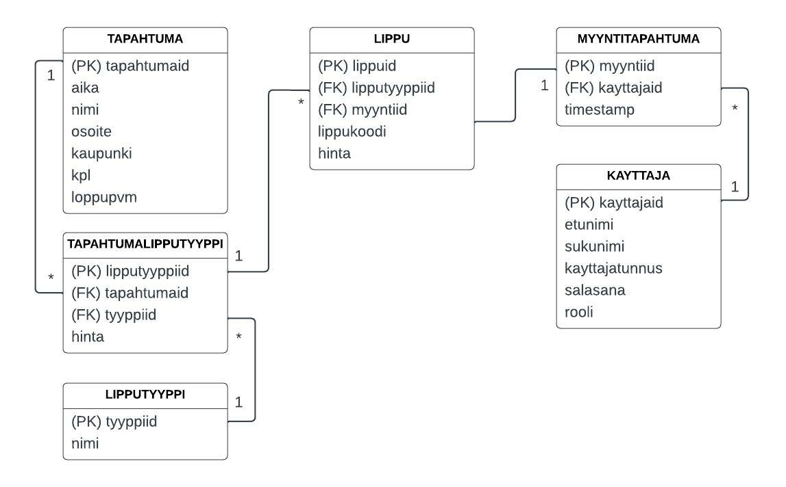

# TicketGuru - Team Etappi

Tiimi: Anne Pelin, Elia Ahonen, Pertti Korhonen, Taina Kankainen

Lähde dokumentaatiopohjalle: [https://github.com/mruonavaara/projektikurssi/blob/master/README.md](https://github.com/mruonavaara/projektikurssi/blob/master/README.md)

## Johdanto

-   Projektina on myyntipisteen lipunmyyntijärjestelmä, alustavalta nimeltä TicketGuru, joka toteutetaan lipputoimisto asiakkaalle (edustajana tuoteomistaja Markku Ruonavaara). Projektissa rakennetaan lipunmyyntijärjestelmä lipunmyyntipisteen myyjille - kyseessä ei siis ole verkkoalusta, josta asiakas voi itse käydä ostamassa lipun. Järjestelmässä tulee voida käsitellä tapahtumia, joihin lippuja myydään, myydä lippuja ja tulostaa niitä, sekä seurata myyntiä.
-   Toteutus- ja toimintaympäristö lyhyesti:  
    -   REST-palvelu ja tietokanta, sisältäen CRUD-toiminnallisuudet järjestelmän sisältämille tiedoille, sekä osittaisen käyttäjän tunnistautumistarpeen
    -   Päätelaitteina laptop/desktop, palvelu toteutetaan Javalla Spring Boot -kehyksen avulla ja tulokset talletetaan GitHubiin

## Järjestelmän määrittely

### Roolit
- lipputoimiston työntekijä
- lipunmyyntipisteen lipunmyyjä

### Käyttötapauskaavio

### Käyttäjätarinat
##### Tunnus: K1
Lipputoimiston työntekijänä haluan, että voin luoda myynnissä olevat tapahtumat,
koska lipunmyyntipisteen myyjän pitää pystyä myymään lippuja tiettyyn tapahtumaan.
prioriteetti = 1, tyyppi: toiminnallinen
##### Tunnus: K2
Lipputoimiston työntekijänä haluan pystyä muuttamaan tapahtuman tietoja, koska on mahdollista, että ohjelmassa olevaa tietoa pitää ajantasaistaa
prioriteetti = 1, tyyppi: toiminnallinen
##### Tunnus: K3 
Lipputoimiston työntekijänä haluan, että voin määritellä tapahtuman lipputyypit, 
koska tapahtumaan pitää pystyä myymään lippuja eri asiakastyypeille.
prioriteetti = 1, tyyppi: toiminnallinen
##### Tunnus: K4 
Lipputoimiston työntekijänä haluan, että voin määritellä lipputyyppien hinnan tapahtumittain, 
koska pitää pystyä myymään eri hintaisia lippuja eri asiakastyypeille.
prioriteetti = 1, tyyppi: toiminnallinen
##### Tunnus: K5
Lipunmyyjänä haluan, että voin hakea tapahtumia eri hakusanoilla, koska asiakkaalle pitää voida myydä lippu hänen haluamaansa tapahtumaan
prioriteetti = 1, tyyppi: toiminnallinen
##### Tunnus: K6
Lipunmyyjänä haluan, että voin myydä lipun tiettyyn tapahtumaan, koska asiakkaalle pitää voida myydä lippu hänen haluamaansa tapahtumaan
prioriteetti = 1, tyyppi: toiminnallinen
##### Tunnus: K7
Lipunmyyjänä haluan nähdä tapahtuman jäljellä olevien lippujen määrän, jotta lippuja ei myydä tapahtumaan liikaa
prioriteetti = 1, tyyppi: toiminnallinen
###### Tunnus: K8
Lipunmyyjänä haluan pystyä myymään useita lippuja samalla tilauksella, jotta jokaista lippua ei tarvitse myydä erikseen
prioriteetti = 1, tyyppi: toiminnallinen
##### Tunnus: K9
Lipunmyyjänä haluan, että voin tulostaa lippuja, koska asiakkaalle pitää tulostaa ostettu lippu 
prioriteetti = 1, Tyyppi: toiminnallinen
##### Tunnus: K10
Lipunmyyjänä haluan, että voin tulostaa myymättä jääneet liput, koska liput pitää olla myytävissä tapahtuman ovella.
prioriteetti = 1, tyyppi: toiminnallinen
##### Tunnus: K11
Käyttäjätarina:
Lipputoimiston työntekijänä haluan nähdä raportin tapahtumaan myydyistä ja myymättömistä lipuista, jotta voin seurata myyntiä
prioriteetti = 2, tyyppi: toiminnallinen

## Käyttöliittymä

[Wireframe-malli](https://github.com/tkankainen/etappi-ticketguru/blob/development/Kuvat/TicketGuru%20UI.pdf) kuvaa alustavasti käyttöliittymän toimintoja.

## Tietokanta

Lisäksi kukin järjestelmän tietoelementti ja sen attribuutit kuvataan
tietohakemistossa. Tietohakemisto tarkoittaa yksinkertaisesti vain jokaisen elementin (taulun) ja niiden
attribuuttien (kentät/sarakkeet) listausta ja lyhyttä kuvausta esim. tähän tyyliin:

> ### _Tapahtuma_
> _Tapahtuma-taulu sisältää tapahtumat. Tapahtumia voi olla monia._
>
> Kenttä | Tyyppi | Kuvaus
> ------ | ------ | ------
> tapahtumaid | auto PK | Tapahtuman id
> aika | date | Tapahtuman ajankohta (date & time)
> nimi | varchar(100) | Tapahtuman nimi
> osoite | varchar(100) | Tapahtuman osoite
> kaupunki | varchar(100) | Tapahtuman kaupunki
> kpl | int | Myytävien lippujen määrä
> loppupvm | date | Ajankohta, jolloin lippujen ennakkomyynti päättyy

> ### _Tapahtumalipputyyppi_
> _Tapahtumalipputyyppi-taulu sisältää lippujen hinnat ja yhdistää tapahtuman, lipun ja lipputyypin._
>
> Kenttä | Tyyppi | Kuvaus
> ------ | ------ | ------
> lipputyyppiid | auto PK | Taulun oma id
> tapahtumaid | FK | Tapahtuma-taulun id
> tyyppiid | FK | Lipputyyppi-taulun id
> hinta | int | Lipun hinta (perustuu lipputyyppiin)

> ### _Lipputyyppi_
> _Lipputyyppi-taulu sisältää tapahtumien lipputyyppien nimet._
>
> Kenttä | Tyyppi | Kuvaus
> ------ | ------ | ------
> tyyppiid | auto PK | Taulun oma id
> nimi | varchar(50) | Lipputyypi nimi (esim. aikuinen/eläkeläinen/opiskelija)

> ### _Lippu_
> _Lippu-taulu sisältää tapahtumien lippujen tiedot. Lippuja voi olla monia._
>
> Kenttä | Tyyppi | Kuvaus
> ------ | ------ | ------
> lippuid | auto PK | Taulun oma id
> lipputyyppiid | FK | Tapahtumalipputyyppi-taulun id
> myyntiid | FK | Myyntitapahtuma-taulun id
> lippukoodi | varchar(50) | Lipun luettava myyntikoodi
> hinta | int | Lipun hinta

> ### _Myyntitapahtuma_
> _Myyntitapahtuma-taulu sisältää tiedot tehdyistä myyntitapahtumista._
>
> Kenttä | Tyyppi | Kuvaus
> ------ | ------ | ------
> myyntiid | auto PK | Taulun oma id
> kayttajaid | FK | Kayttaja-taulun id
> timestamp | timestamp | Myyntitapahtuman kellonaika ja päiväys

> ### _Kayttaja_
> _Kayttaja-taulu sisältää kaikkien järjestelmää käyttävien henkilöiden tiedot (lipunmyyjät/lipputoimiston työntekijät)._
>
> Kenttä | Tyyppi | Kuvaus
> ------ | ------ | ------
> kayttajaid | auto PK | Taulun oma id
> etunimi | varchar(50) | Käyttäjän etunimi
> sukunimi | varchar(50) | Käyttäjän sukunimi
> kayttajatunnus | varchar(25) | Käyttäjätunnus
> salasana | varchar(100) | Salasana
> rooli | varchar(50) | Käyttäjän rooli (lipunmyyjä/lipputoimiston työntekijä)

## Tekninen kuvaus

Back end palvelu toteutettu Java Spring Boot sovelluskehyksellä
- Ohjelmointiympäristö:
- Eclipse IDE for Java EE , Java-kehitysympäristö
- Maven projekti
- Autentikointi:
- JSON Web Token
- Tietokanta:
- PostgreSQL
- Julkaisu, pilvipalvelu:
- Heroku
- Versionhallinta:
- Git
- Front End:
- React js.

## Testaus

Tässä kohdin selvitetään, miten ohjelmiston oikea toiminta varmistetaan
testaamalla projektin aikana: millaisia testauksia tehdään ja missä vaiheessa.
Testauksen tarkemmat sisällöt ja testisuoritusten tulosten raportit kirjataan
erillisiin dokumentteihin.

Tänne kirjataan myös lopuksi järjestelmän tunnetut ongelmat, joita ei ole korjattu.

## Asennustiedot

Järjestelmän asennus on syytä dokumentoida kahdesta näkökulmasta:

-   järjestelmän kehitysympäristö: miten järjestelmän kehitysympäristön saisi
    rakennettua johonkin toiseen koneeseen

-   järjestelmän asentaminen tuotantoympäristöön: miten järjestelmän saisi
    asennettua johonkin uuteen ympäristöön.

Asennusohjeesta tulisi ainakin käydä ilmi, miten käytettävä tietokanta ja
käyttäjät tulee ohjelmistoa asentaessa määritellä (käytettävä tietokanta,
käyttäjätunnus, salasana, tietokannan luonti yms.).

## Käynnistys- ja käyttöohje

Tyypillisesti tässä riittää kertoa ohjelman käynnistykseen tarvittava URL sekä
mahdolliset kirjautumiseen tarvittavat tunnukset. Jos järjestelmän
käynnistämiseen tai käyttöön liittyy joitain muita toimenpiteitä tai toimintajärjestykseen liittyviä asioita, nekin kerrotaan tässä yhteydessä.

Usko tai älä, tulet tarvitsemaan tätä itsekin, kun tauon jälkeen palaat
järjestelmän pariin !
